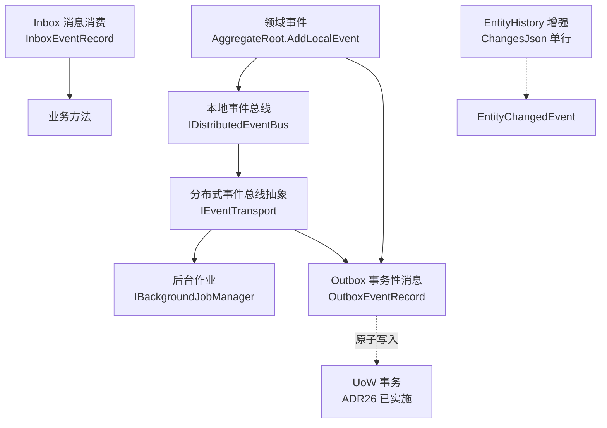

# 事件总线与消息基础设施

> **✅ 状态提示**：本文描述的是一套**已实施**的事件与消息基础设施（对应 `_TKWF/docs/D15` 设计方案与 ADR21-26）。V4.9.64 完成事件机制全链路（W2 本地事件总线 + W4 SG 派发表 + W5 EntityHistory + W7 后台作业 + W8 RabbitMQ 分布式 + W9 Outbox/Inbox + W10 RPC 侧信道）；V4.9.66 增强（DbDistributedLock + Inbox 清理 + 跨租户事件传播 + Fire-and-Forget 发布）。框架能力均已可用，可按本文所述使用。

---

## 为什么需要事件机制

TKWF.Domain 以 `DomainUser` 非空执行流 + AOP 静态拦截器为核心架构。业务方法执行后，状态变更的影响范围**仅限于当前方法返回值**——没有机制让"领域行为"自动触发后续处理。

**什么是"副作用"？** 订单创建后要发通知、实体变更后要刷缓存、跨服务要通知库存扣减——这些都是"业务方法完成后的后续处理"，统称**副作用（side effect）**。

没有事件机制时，这些副作用只能写在业务方法里：

| 场景 | 无事件机制（耦合） | 有事件机制（解耦） |
|:--|:--|:--|
| 订单创建后发通知 | 业务方法内手动调 `INotificationService` | `AddLocalEvent(OrderCompleted)`，处理器自动触发 |
| 实体变更后刷缓存 | 业务方法内手动调 `IContentCache.Invalidate` | `EntityChangedEvent` 自动派发，缓存处理器自动刷新 |
| 跨服务通知库存 | 直接调下游 `InventoryService`，耦合+无事务保障 | 经分布式事件总线发布，下游异步消费 |
| 定时任务（超时取消） | 每个宿主自行集成 Hangfire | `IBackgroundJobManager` 统一抽象，SystemActor 自动绑定 |
| 属性级审计 diff | `EntityHistoryFilter` 只记整体操作 | `ChangesJson` 单行存储属性级 diff + 事件驱动 |

**核心痛点**：业务逻辑与基础设施耦合——改通知方式要改业务代码，漏刷缓存就出 bug。

事件机制把"发生了什么"（领域事件）和"怎么处理"（事件处理器）**分离**，由框架负责派发、重试、异常隔离。

---

## 设计全景：6 大模块

对标 ABP Framework 的事件/消息体系（11 维功能），TKWF 规划 6 大模块：



| 模块 | 对应 ADR | 状态 | 一句话 |
|:--|:--|:--|:--|
| 领域事件 | ADR21 | ✅ 已实施 | 聚合根内 `AddLocalEvent`，事务提交后派发 |
| 本地/分布式事件总线 | ADR22 | ✅ 已实施 | 总线抽象 + IEventTransport 传输抽象（RabbitMQ 实现） |
| 后台作业 | ADR23 | ✅ 已实施 | IBackgroundJobManager + SystemActor 自动绑定 + tenantId 上下文 |
| Outbox/Inbox | ADR24 | ✅ 已实施 | 事务性消息 + 幂等消费 + 防乱序 + Inbox 清理 |
| EntityHistory | ADR25 | ✅ 已实施 | 属性级 Diff + ChangesJson 单行 + 事件驱动 |
| **UoW 事务** | **ADR26** | **✅ 已实施** | **事件派发依赖的原子性地基（V4.9.52）** |

---

## 快速开始：3 步使用领域事件

> 领域事件是最常用的模块。以下 3 步覆盖 80% 场景。分布式/后台作业等高级能力见后续章节。

**第 1 步：定义事件**——一个 POCO 类，描述"发生了什么"：

```csharp
// 领域事件就是一个普通 POCO
public record OrderCompletedEvent(long OrderId);
```

**第 2 步：在聚合根中发布事件**——调用 `AddLocalEvent` 声明事件：

```csharp
public class Order : AggregateRoot        // 聚合根基类提供 AddLocalEvent
{
    public void Complete()
    {
        Status = OrderStatus.Completed;
        AddLocalEvent(new OrderCompletedEvent(Id));  // 声明"订单完成了"
    }
}
```

**第 3 步：编写处理器**——标注 `[DomainEventHandler]`，SG 编译期自动注册到总线：

```csharp
[DomainEventHandler]                          // ← SG 自动注册，无需手动 Register
public class OrderCompletedHandler : IDomainEventHandler<OrderCompletedEvent>
{
    public async Task HandleAsync(OrderCompletedEvent e, CancellationToken ct)
    {
        await _notificationService.NotifyAsync(e.OrderId, ct);  // 发通知
        await _cache.InvalidateAsync($"order:{e.OrderId}", ct); // 刷缓存
    }
}
```

完成。框架在事务提交后自动派发事件、调用处理器。异常隔离——处理器报错不会让业务方法 500。

---

## 领域事件（ADR21）

> 基本用法见上文「快速开始」。本节解释**派发时机**这一核心设计决策。

**派发时机**（关键决策）：事件什么时候派发——是在事务提交前还是提交后？

| 时机 | 行为 | 适用场景 |
|:--|:--|:--|
| **Pre-commit**（提交前） | `EventDispatchFilter` 在 AOP PostProceed 阶段、事务 `CommitAsync` 之前派发 | 处理器需参与当前事务（如写审计日志到同事务） |
| **Post-commit**（提交后） | `StaticDomainInterceptor` 在 `CommitAsync` 之后派发 | 处理器读到的数据是已提交的（如发通知、刷缓存） |

框架默认使用 **Post-commit**——确保处理器读到的是持久化后的数据。需要 Pre-commit 时通过 AOP 过滤器链配置。

**异常隔离**：事件处理器异常**不抛给调用方**（业务方法已完成），由框架记录日志。这防止"订单已完成但发通知失败导致整个请求报 500"——用户体验上，订单完成是成功的，通知重试由框架负责。

---

## 事件总线（ADR22）

**目标**：本地调用与跨进程消息统一抽象。领域事件在**进程内**派发；分布式场景需跨进程投递。

```
业务方法
  └─> IDistributedEventBus.PublishAsync(e)
        ├─> LocalDistributedEventBus（进程内，本地事件处理器直连）
        └─> IEventTransport.PublishAsync（可插拔传输层）
              └─> RabbitMQ（已实现）/ 自定义（Kafka 等）
```

**架构决策**：调研 DotNetCore.CAP 后确认，CAP 有 3 个 gap（不支持 TransactionScope、不支持 FreeSql、无 Inbox 幂等），因此 **TKWF 自研 Outbox/Inbox 引擎**，传输层仅复用其发布订阅协议。RabbitMQ 是 V4.9.64 落地的首个 `IEventTransport` 实现。

---

## 后台作业（ADR23）

**目标**：框架级作业抽象，替代各宿主自行集成 Hangfire 的现状。

```csharp
public interface IBackgroundJobManager
{
    Task<string> EnqueueAsync<TJob>(object? args = null, CancellationToken ct = default);
}

// 作业定义 + [BackgroundJob] SG 自动注册
[BackgroundJob("cancel-expired-orders")]
public class CancelExpiredOrdersJob
{
    public async Task ExecuteAsync(CancellationToken ct) { ... }
}
```

**关键设计**：
- **SystemActor 自动绑定**：后台作业在**系统作用域**（SystemActor）下执行，不需用户会话
- **AsyncLocal 清理契约**：作业执行结束必须清理 AsyncLocal 上下文（防线程池复用串号）——这是 TKWF 领域自治核心的硬要求

---

## Outbox / Inbox（ADR24）

**目标**：解决"本地事务提交"与"消息投递"的原子性问题。

**Outbox（发件箱）**：领域事件与业务数据**同事务写入** Outbox 表，独立投递器保证最终投递。

```
业务事务（UoW）：
  [业务表] 插入订单          ─┐
  [Outbox] 插入待投递事件    ─┘ 同事务提交

OutboxSender（Push-Pull Channel<T> 模式）：
  轮询未投递事件 → 投递到事件总线 → 标记已发送
```

**核心机制**：

| 机制 | 说明 |
|:--|:--|
| `OutboxEventRecord` / `InboxEventRecord` | 经 `IEntityDAC` 存储（ORM 无关） |
| **AggregateVersion 防乱序** | 同一聚合的事件按版本投递，防止乱序处理 |
| **MessageId 幂等** | Inbox 按 MessageId 去重，消费失败重试不重复执行 |
| **TTL 保留** | 过期事件清理策略 |
| **指数退避重试** | 投递失败按退避策略重试，不无限轰炸 |

**Push-Pull 修正**：早期方案用 Push（投递器主动推送），评审后改为 **Push-Pull Channel**（投递器拉取 + 背压）——避免消费者处理慢时投递器阻塞总线。

---

## EntityHistory 增强（ADR25）

**目标**：把 `EntityHistoryFilter` 从"整体操作记录"升级为"属性级 diff"。

**核心变更**：

| 项 | 现状 | 增强（ADR25） |
|:--|:--|:--|
| 存储 | 每次属性变更一行（`PropertyName`/`OldValue`/`NewValue` 空置） | **ChangesJson 单行存储**（整个变更集的 JSON 快照） |
| 事件驱动 | 无 | 发布 `EntityChangedEvent`（含 diff），供缓存刷新/审计/同步消费 |
| 排除 | 无 | `[DisableAuditingFor]` 排除敏感属性 |

```csharp
[AuditRequired]
public class Account : EntityBase
{
    [DisableAuditingFor]           // 不记录余额变更明细？——放行，敏感字段改为"已变更"占位
    public decimal Balance { get; set; }
}
```

**ChangesJson 单行 vs 逐属性多行**：单行 = 一次变更一条记录，读快写快；diff 解析在读取侧完成。避免高频实体（如心跳表）产生海量属性行。

---

## 与 ABP 对标结论

| ABP 模块 | TKWF 借鉴 | TKWF 舍弃/差异 |
|:--|:--|:--|
| EventBus（本地/分布式） | 总线抽象 + 处理器自动注册 | 基于 TKWF 自身 UoW，不套 ABP |
| BackgroundJobs | IBackgroundJobManager 抽象 | 不引 Hangfire，作业在 SystemActor 作用域 |
| Outbox/Inbox | 事务性消息模式 | 引擎自研（CAP 仅作传输层），AggregateVersion 防乱序 |
| Auditing（属性级） | 属性级 diff | ChangesJson 单行存储 |
| Notifications | — | 后续规划（未纳入 ADR21-25） |
| 事件溯源 | — | 设计评审结论：不引入完整事件溯源（复杂度高，收益有限） |

---

## 实施记录

已按依赖顺序全部落地：

```
V4.9.52  ADR26 UoW 事务迁移                    ✅ 已实施
    ↓
V4.9.64  ADR21 领域事件（本地） + ADR22 事件总线 + ADR23 后台作业 + ADR24 Outbox/Inbox + ADR25 EntityHistory
         + W8 RabbitMQ 分布式传输 + W10 RPC 侧信道（CollectedEvents 快照 + SG Decorator 生成）
    ↓
V4.9.66  事件机制 V2 增强：DbDistributedLock（DB 分布式锁）+ InboxCleanupService（TTL 清理）
         + _appliedVersions 持久化（InboxDbVersionStore）+ 跨租户事件上下文传播 + 后台作业 tenantId
         + PostAsync Fire-and-Forget 发布 + EventTypeResolver 跨程序集解析
```

**V4.9.66 关键增强**：

| 能力 | 说明 |
|:--|:--|
| `ILocalEventBus.PostAsync` | Fire-and-Forget 发布，绕过 AOP Bag 直接派发，永不重抛 |
| `DbDistributedLock` | DB 分布式锁（条件 UPDATE + INSERT-SELECT 两步法），跨方言可移植 |
| `InboxCleanupService` | Inbox 过期记录 TTL 清理 |
| `IInboxVersionStore` | `_appliedVersions` 持久化（内存缓存 + 条件 Update 双写） |
| `ITenantScopeRestorer` | 跨租户事件上下文传播（Outbox/Inbox 记录含 TenantId） |
| `IBackgroundJobManager.EnqueueAsync` | 增加可选 `tenantId` 参数，执行时恢复租户上下文 |
| `EventTypeResolver` | 跨程序集事件类型解析（兜底扫描已加载程序集） |

> 每个 ADR 实施前均独立评审（对标 ABP + Oracle 架构评审），实施拆分在 `02-迭代开发/V4/` 的版本开发方案中。

---

## 源文档参考

| 源文档编号 | 标题 | 与本文的关系 |
|:--|:--|:--|
| D15 | 事件总线与消息基础设施-设计方案 | 本文的主设计依据（v1.3，含 27 页完整设计） |
| ADR21 | 领域事件与本地事件总线 | 领域事件机制（内部 ADR） |
| ADR22 | 分布式事件总线抽象 | 总线抽象 + 传输层（内部 ADR） |
| ADR23 | 后台作业基础设施 | 作业管理器（内部 ADR） |
| ADR24 | 事务性OutboxInbox模式 | 事务性消息（内部 ADR） |
| ADR25 | EntityHistory属性级Diff与事件驱动增强 | 审计增强（内部 ADR） |
| ADR26 | UoW事务迁移 | 已实施的事务地基（V4.9.52） |