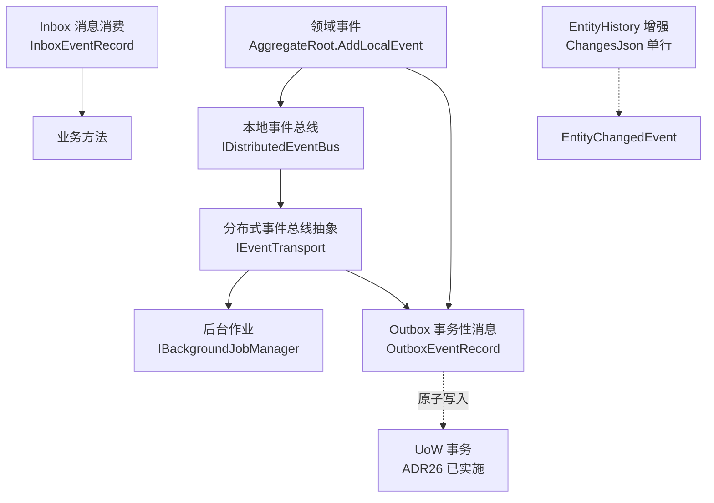

# 事件总线与消息基础设施

> **⚠️ 状态提示**：本文描述的是一套**设计完成、实施规划中**的基础设施（对应 `_TKWF/docs/D15` 设计方案与 ADR21-25）。当前框架已实施的只有其底层依赖——ADR26 UoW 事务管理（V4.9.52）。各模块标注了 ADR 状态，请勿按"已可用功能"使用。

---

## 问题的提出：副作用传播困境

TKWF.Domain V4 以 `DomainUser` 非空执行流 + AOP 静态拦截器 + SG 编译时生成装饰器为核心架构。业务方法执行后，状态变更的影响范围**仅限于当前方法返回值**——没有机制让"领域行为"自动触发后续处理。

典型场景：

1. 订单创建后需发通知 → 业务方法内手动调 `INotificationService`，业务逻辑与基础设施耦合
2. 实体变更后需刷新缓存 → 业务方法内手动调 `IContentCache.Invalidate`，容易遗漏
3. 跨服务通知（订单→库存扣减）→ 直接调下游 Service，耦合且无事务边界保障
4. 定时任务（超时订单取消）→ 无框架级后台作业抽象，每个宿主自行集成 Hangfire
5. 消息消费（MQ 消费者处理外部事件）→ 有 `StandaloneDomainUserAccessor` 接入点但无统一作业管理器
6. 合规审计需属性级 diff → `EntityHistoryFilter` 只记整体操作，属性级字段空置

这些场景的共同特征：**领域行为完成后，需触发一个或多个后续处理（副作用），但当前框架无统一机制管理副作用的生命周期。**

---

## 设计全景：6 大模块

对标 ABP Framework 的事件/消息体系（11 维功能），TKWF 规划 6 大模块：



| 模块 | 对应 ADR | 状态 | 一句话 |
|:--|:--|:--|:--|
| 领域事件 | ADR21 | 提议 | 聚合根内 `AddLocalEvent`，事务提交后派发 |
| 本地/分布式事件总线 | ADR22 | 提议 | 总线抽象 + IEventTransport 传输抽象 |
| 后台作业 | ADR23 | 提议 | IBackgroundJobManager + SystemActor 自动绑定 |
| Outbox/Inbox | ADR24 | 提议 | 事务性消息 + 幂等消费 + 防乱序 |
| EntityHistory | ADR25 | 提议 | 属性级 Diff + 事件驱动 |
| **UoW 事务** | **ADR26** | **✅ 已实施** | **事件派发依赖的原子性地基 |

---

## 领域事件（ADR21）

**目标**：让聚合根能表达"发生了什么"，由框架统一负责派发。

```csharp
public class Order : AggregateRoot
{
    public void Complete()
    {
        Status = OrderStatus.Completed;
        AddLocalEvent(new OrderCompletedEvent(Id));  // 声明"我完成了"
    }
}

// 事件处理器——SG [DomainEventHandler] 自动注册
[DomainEventHandler]
public class OrderCompletedHandler : IDomainEventHandler<OrderCompletedEvent>
{
    public Task HandleAsync(OrderCompletedEvent e, CancellationToken ct)
        => _notificationService.NotifyAsync(e.OrderId, ct);
}
```

**派发时机设计**（关键决策）：

| 时机 | 行为 | 理由 |
|:--|:--|:--|
| Pre-commit 派发 | `EventDispatchFilter` 在 PostProceed**之前** | 事件处理器可参与当前事务 |
| Post-commit 派发 | `StaticDomainInterceptor` 在 `CommitAsync` **之后** | 事件处理器读到的数据是已提交的 |

**异常隔离**：事件处理器异常**不抛给调用方**（业务方法已完成），由框架记录日志。这防止"订单已完成但发通知失败导致整个请求报 500"。

SG `[DomainEventHandler]` 自动注册到总线，业务无需手动 `Register`。

---

## 事件总线（ADR22）

**目标**：本地调用与跨进程消息统一抽象。

```
业务方法
  └─> IDistributedEventBus.PublishAsync(e)
        ├─> LocalDistributedEventBus（进程内，TryRegister 等价，本地事件处理器直连）
        └─> IEventTransport.PublishAsync（可插拔传输层）
              └─> CAP（可选） / Kafka / RabbitMQ / 自定义
```

**CAP 的定位（重要评估结论）**：调研了 DotNetCore.CAP（v10.0.2，MIT，7K+ stars）后确认——CAP 有 3 个关键 gap：

1. 不支持 `TransactionScope`（TKWF 原事务机制）
2. 不支持 FreeSql（对接成本高）
3. 无 Inbox/幂等消费

因此 **CAP 仅作为可选传输层**（其发布订阅协议可复用），不作为 Outbox/Inbox 引擎。

---

## 后台作业（ADR23）

**目标**：框架级作业抽象，替代各宿主自行集成 Hangfire 的现状。

```csharp
public interface IBackgroundJobManager
{
    Task<string> EnqueueAsync<TJob>(object? args = null, CancellationToken ct = default);
}

// 作业定义 + [BackgroundJob] SG 自动注册
[BackgroundJob("cancel-expired-orders")]
public class CancelExpiredOrdersJob
{
    public async Task ExecuteAsync(CancellationToken ct) { ... }
}
```

**关键设计**：
- **SystemActor 自动绑定**：后台作业在**系统作用域**（SystemActor）下执行，不需用户会话
- **AsyncLocal 清理契约**：作业执行结束必须清理 AsyncLocal 上下文（防线程池复用串号）——这是 TKWF 领域自治核心的硬要求

---

## Outbox / Inbox（ADR24）

**目标**：解决"本地事务提交"与"消息投递"的原子性问题。

**Outbox（发件箱）**：领域事件与业务数据**同事务写入** Outbox 表，独立投递器保证最终投递。

```
业务事务（UoW）：
  [业务表] 插入订单          ─┐
  [Outbox] 插入待投递事件    ─┘ 同事务提交

OutboxSender（Push-Pull Channel<T> 模式）：
  轮询未投递事件 → 投递到事件总线 → 标记已发送
```

**核心机制**：

| 机制 | 说明 |
|:--|:--|
| `OutboxEventRecord` / `InboxEventRecord` | 经 `IEntityDAC` 存储（ORM 无关） |
| **AggregateVersion 防乱序** | 同一聚合的事件按版本投递，防止乱序处理 |
| **MessageId 幂等** | Inbox 按 MessageId 去重，消费失败重试不重复执行 |
| **TTL 保留** | 过期事件清理策略 |
| **指数退避重试** | 投递失败按退避策略重试，不无限轰炸 |

**Push-Pull 修正**：早期方案用 Push（投递器主动推送），评审后改为 **Push-Pull Channel**（投递器拉取 + 背压）——避免消费者处理慢时投递器阻塞总线。

---

## EntityHistory 增强（ADR25）

**目标**：把 `EntityHistoryFilter` 从"整体操作记录"升级为"属性级 diff"。

**核心变更**：

| 项 | 现状 | 增强（ADR25） |
|:--|:--|:--|
| 存储 | 每次属性变更一行（`PropertyName`/`OldValue`/`NewValue` 空置） | **ChangesJson 单行存储**（整个变更集的 JSON 快照） |
| 事件驱动 | 无 | 发布 `EntityChangedEvent`（含 diff），供缓存刷新/审计/同步消费 |
| 排除 | 无 | `[DisableAuditingFor]` 排除敏感属性 |

```csharp
[AuditRequired]
public class Account : EntityBase
{
    [DisableAuditingFor]           // 不记录余额变更明细？——放行，敏感字段改为"已变更"占位
    public decimal Balance { get; set; }
}
```

**ChangesJson 单行 vs 逐属性多行**：单行 = 一次变更一条记录，读快写快；diff 解析在读取侧完成。避免高频实体（如心跳表）产生海量属性行。

---

## 与 ABP 对标结论

| ABP 模块 | TKWF 借鉴 | TKWF 舍弃/差异 |
|:--|:--|:--|
| EventBus（本地/分布式） | 总线抽象 + 处理器自动注册 | 基于 TKWF 自身 UoW，不套 ABP |
| BackgroundJobs | IBackgroundJobManager 抽象 | 不引 Hangfire，作业在 SystemActor 作用域 |
| Outbox/Inbox | 事务性消息模式 | 引擎自研（CAP 仅作传输层），AggregateVersion 防乱序 |
| Auditing（属性级） | 属性级 diff | ChangesJson 单行存储 |
| Notifications | — | 后续规划（未纳入 ADR21-25） |
| 事件溯源 | — | 设计评审结论：不引入完整事件溯源（复杂度高，收益有限） |

---

## 实施规划

按依赖顺序：

```
V4.9.52  ADR26 UoW 事务迁移        ✅ 已实施
    ↓
下一步  ADR21 领域事件（本地）      ← 依赖 UoW 的事务提交后派发时机
    ↓
ADR22 事件总线抽象 + IEventTransport
    ↓
ADR23 后台作业（SystemActor 绑定）
    ↓
ADR24 Outbox/Inbox（依赖 21/22）
ADR25 EntityHistory 增强
```

> 每个 ADR 实施前需独立评审（对标 ABP 对标分析 + Oracle 架构评审），实施拆分到 `02-迭代开发/V4/` 的版本开发方案。

---

## 源文档参考

| 源文档编号 | 标题 | 与本文的关系 |
|:--|:--|:--|
| D15 | 事件总线与消息基础设施-设计方案 | 本文的主设计依据（v1.3，含 27 页完整设计） |
| ADR21 | 领域事件与本地事件总线 | 领域事件机制（内部 ADR） |
| ADR22 | 分布式事件总线抽象 | 总线抽象 + 传输层（内部 ADR） |
| ADR23 | 后台作业基础设施 | 作业管理器（内部 ADR） |
| ADR24 | 事务性OutboxInbox模式 | 事务性消息（内部 ADR） |
| ADR25 | EntityHistory属性级Diff与事件驱动增强 | 审计增强（内部 ADR） |
| ADR26 | UoW事务迁移 | 已实施的事务地基（V4.9.52） |