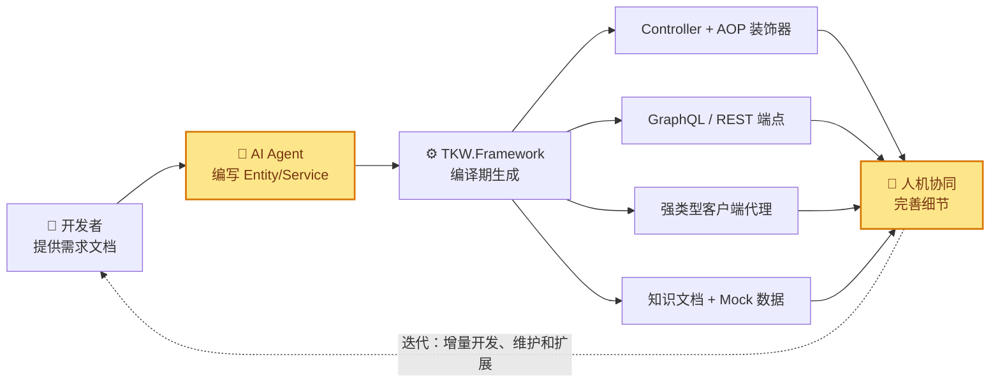

<!-- ===== 区块 1: Hero ===== -->

<div class="hero-section">
  <div class="hero-badges">
    
    
    
  </div>
<h1>TKW.Framework — 让 Agentic Engineering 更可控、更可靠的软件开发框架</h1>
  <p class="lead">
    <strong>开发者思考意图 → AI 辅助实现 → 框架约束保障</strong>
  </p>

#### Agent 思考越少越可控，框架支撑越多越可靠

<div class="hero-cta">
    <a href="articles/getting-started.md" class="btn btn-primary">🚀 5 分钟快速开始</a>
    <a href="articles/intro.md" class="btn btn-outline-light">📖 框架概览</a>
    <a href="articles/agentic/quick-start-for-ai.md" class="btn btn-outline-light">🤖 AI 快速上手</a>
  </div>
</div>

---

<!-- ===== 区块 2: Agentic 友好度评分结论 ===== -->

## Agentic Engineering 最友好的框架：TKW.Framework

业界对 Agentic 友好度 10 维准则评估，TKWF 全维度满分：

- **ABP Framework** —— 24/50
- **Axon Framework** —— 30/50
- **TKW.Framework** —— **50/50** ✅

业界趋势信号：

- **ABP Framework** 社区投票用 Source Generator 替代 DynamicProxy（issue `#7198`，2026.03）
- **`lint4sg`**（2026.03）——专为约束 AI 而建的编译期分析器，与 TKWF 编译期约束路线一致
- **Spring AOP** `@Retryable` 静默失败（Doctolib 2026.05）——运行时代理的静默失败是 AI 无法自诊断的致命问题

→ **完整评估报告（10 维逐条详解 + CQRS 架构 + 诚实限制）见 [Agentic Coding 友好度评估](articles/explanation/agentic-evaluation.md)**

---

<!-- ===== 区块 3: Agentic Engineering 三方分工 ===== -->

## TKW.Framework：合理分工，更可控、更可靠

> **Agentic Engineering** — 你不直接写代码 99% 的时间，你在编排 Agent 并充当监督者。
> —— Andrej Karpathy, 2026

TKWF 框架自动完成**尽可能多**，只需少量业务代码：



将需求分解为最小粒度交给 Agent：一个用例 = 一个 Service 方法，无需理解全局架构、DI 配置、路由注册、序列化细节，**没有机会犯错**。

> **粒度细分 = 模型更少思考 = 更高可控性和可靠性 = 更低上下文依赖和 Token 消耗。**

```csharp
// 开发者 + Agent 只写这一份
[GenerateController]
public class OrderService(DomainUser<AppUserInfo> user)
    : DomainServiceBase<AppUserInfo>(user)
{
    [AuthorityFilter(Roles = "Admin")]
    [Transactional]
    public async Task<Order> CreateAsync(string title) { ... }
}

// 编译期自动产出 5 份（开发者不用写，Agent 也不用写）：
// → IOrderServiceController.g.cs         (契约接口)
// → OrderServiceControllerDecorator.g.cs  (AOP 装饰器)
// → OrderServiceResolver.g.cs            (GraphQL Resolver)
// → OrderServiceEndpoints.g.cs           (REST 端点)
// → OrderServiceClient.g.cs              (客户端代理)
```

---

<!-- ===== 区块 4: 五大设计支柱 ===== -->

## 凭什么满分？五大设计支柱

<div class="agentic-banner">
  <div class="banner-icon">🧩</div>
  <div class="banner-content">
    <h3>领域自治 — 编译即运行，零运行时惊喜</h3>
    <p>DomainUser 不进 DI 容器不会串号、不经动态代理、不被运行时反射——<strong>代码所写即所得</strong>，AI 和人类看到同一份可预测的执行流。<br>20+ 编译期诊断直接 fail build，结构错误编译期暴露，不合规代码根本编译不过。</p>
  </div>
</div>

<div class="agentic-banner">
  <div class="banner-icon">⚡</div>
  <div class="banner-content">
    <h3>仅极少业务代码 — 一行标注，编译期产出全部管道</h3>
    <p>无需手写 Controller/路由/DI 注册/客户端代理——传统样板代码占 70%。<br><code>[GenerateController]</code> 一行标注 → 编译期生成 5 份管道（Controller+AOP+GraphQL+REST+Client）+ AutoQuery 消除 80% 手写查询 Service。</p>
  </div>
</div>

<div class="agentic-banner">
  <div class="banner-icon">📊</div>
  <div class="banner-content">
    <h3>架构级读写分离 — 视图即统计，前后端配合更丝滑</h3>
    <p>传统痛点：前端需要各种复杂查询和统计，且经常因 UI 调整而更改——后端最大工作量在复杂查询类方法（分页/分组/聚合）。<br>Entity（写模型）/ VEntity（读模型）在<strong>类型系统级分离</strong>：只需调整视图（ViewSql），框架自动持久化 DB 视图 + 编译期列名校验，<strong>自动生成统计 Dto</strong>（扫描 SUM/COUNT/AVG/MIN/MAX 推断类型）+ AutoQuery 自动生成分页查询——几乎不需要编写代码。三端统一 <code>User.Query&lt;T&gt;()</code> 入口 + GraphQL 聚合查询。</p>
  </div>
</div>

<div class="agentic-banner">
  <div class="banner-icon">🔗</div>
  <div class="banner-content">
    <h3>全栈一致 — C#/Wasm/TypeScript + 无后端自验证</h3>
    <p>避免前后端 API 不一致，测试无需运行后端——分工同步开发，各自验证。<br><code>ts-client</code> 与 C# API 形态完全镜像（<code>Use&lt;T&gt;()</code> / <code>Query&lt;T&gt;()</code>），<code>ts-client-mock</code> 两级 mock（离线 MockTransport + HTTP MockHttpServer）让 Agent 无需运行后端即可自验证全链路。</p>
  </div>
</div>

<div class="agentic-banner">
  <div class="banner-icon">📚</div>
  <div class="banner-content">
    <h3>文档 — Agent 无需先验知识，按图索骥</h3>
    <p>AI 无需了解框架约定，无需读大量源码。<br>7 个框架级 Skills 分步引导 + <code>Domain Map/Api 文档</code> + 阅读活文档替代源码 + <code>TKWF_Rules.md</code> 路由中枢——Agent 只加载当前域薄索引，无需理解全局架构。</p>
  </div>
</div>

---

<!-- ===== 区块 5: 路径卡片 ===== -->

## 从这里开始

<div class="path-grid">
  <a href="articles/getting-started.md" class="path-card">
    <h3>🚀 快速探索</h3>
    <p><strong>5 分钟感受"标注即生成"</strong></p>
    <p>安装 NuGet → 写 Service → 标注 → 编译即得 GraphQL + REST 端点</p>
  </a>
  <a href="articles/intro.md" class="path-card">
    <h3>📖 框架概览</h3>
    <p><strong>Agentic Engineering 全景</strong></p>
    <p>三方分工、代码生成管线、多协议暴露、安全体系——每段都带代码示例</p>
  </a>
  <a href="articles/explanation/why-domain-autonomy.md" class="path-card">
    <h3>🔬 深度理解</h3>
    <p><strong>为什么这样设计？</strong></p>
    <p>领域自治 vs DI 容器、编译期 AOP 原理、三层 SG 管线解剖</p>
  </a>
  <a href="articles/agentic/quick-start-for-ai.md" class="path-card">
    <h3>🤖 AI 快速上手</h3>
    <p><strong>给 Agent 的速查卡</strong></p>
    <p>框架规则、Prompt 模板、源文档映射表——让 AI 高质量生成 Service</p>
  </a>
</div>

---

<!-- ===== 区块 6: 场景卡片 ===== -->

## Talk is Cheap, Show me the Code

> 每个场景都是痛点 + 亮点 + 代码——三层分别自动完成、高度一致。

<div class="scenario-card">
  <div class="scenario-card-header">1️⃣ Agent 编写 Entity → 自动建表建视图 + 自动生成 Dto/DataService/Conditions</div>
  <div class="scenario-card-body">
    <p>定义实体字段 + ORM 注解，xCodeGen 自动生成 DTO、DataService（CRUD）、Conditions（查询条件）、Dto 映射代码。</p>
    <p>无需手写样板。</p>

```csharp
[DomainGenerateCode(IsView = true, AutoQuery = true)]
public class OrderView : VEntity
{
    [Column(Name = "order_id")]      public long OrderId { get; set; }
    [Column(Name = "amount")]        public decimal Amount { get; set; }
    [Column(Name = "status")]        public string Status { get; set; }
}
// xCodeGen 自动生成：OrderViewDto / OrderViewDataService / OrderViewConditions / 映射代码
// ViewSql 编译期列名校验——列名不匹配直接 warning + 运行时启动阻断
```

同样，定义普通 Entity 也自动生成 CRUD 的 DataService + Conditions + Dto——查询/更新直接链式调用，返回强类型 Dto：

```csharp
// 自动生成的 OrderDataService + OrderConditions —— 直接链式使用
var ds = User.Use<OrderDataService>();
var list = await ds.Query
    .Where(OrderConditions.Status.Eq("Paid"))        // Conditions 链式条件
    .And(o => o.Amount >= 100)
    .OrderByDescending(o => o.CreateTime)
    .Page(1, 20)
    .ToListAsync()
    .ToDtoList<OrderDto>();                            // 自动映射 DTO

var orderDto = await ds.GetAsync(1L).ToDto<OrderDto>();  // 单条转 DTO
var count = await ds.Query.CountAsync();                  // 计数
```

</div>
</div>

<div class="scenario-card">
  <div class="scenario-card-header">2️⃣ Agent 编写 Service → 自动生成 Controller + 自动暴露 WebApi</div>
  <div class="scenario-card-body">
    <p>公共业务方法自动生成 Controller + AOP 框架支持 + WebApi GraphQL/REST 端点。</p>
    <p>业务领域层内部调用 <code>User.Use&lt;T&gt;()</code> 获取所需的 DataService，Conditions 链式查询，声明式认证/审计/事务。</p>

```csharp
[GenerateController]
public class OrderService(DomainUser<AppUserInfo> user)
    : DomainServiceBase<AppUserInfo>(user)
{
    [AuthorityFilter(Roles = "Admin")]   // ← 声明式权限
    [Transactional]                       // ← 声明式事务
    public async Task<OrderDto> CreateAsync(string title)
    {
        var ds = User.Use<OrderDataService>();           // 获取 DataService
        var order = new Order { Title = title, UserId = User.UserId };
        await ds.InsertAsync(order);                        // 自动审计 CreateBy/CreateTime
        return order.ToDto<OrderDto>();                     // 自动映射 DTO
    }

    public async Task<List<OrderDto>> QueryAsync(string keyword)
    {
        var ds = User.Use<OrderDataService>();
        var list = await ds.Query                          // Conditions 链式查询
            .Where(o => o.Title.Contains(keyword))
            .OrderByDescending(o => o.CreateTime)
            .ToListAsync();
        return list.ToDtoList<OrderDto>();
    }

}
// 编译期自动生成 5 份：Controller / AOP Decorator / GraphQL Resolver / REST Endpoint / Client
```

</div>

</div>

<div class="scenario-card">
  <div class="scenario-card-header">3️⃣ 客户端 Wasm → 自动调用 WebApi + 增强查询</div>
  <div class="scenario-card-body">
    <p>Wasm 端 <code>User.Use&lt;T&gt;()</code> 调用 Service，<code>User.Query&lt;T&gt;()</code> 链式查询——与进程内 C# API 表面同构，查询能力一致。</p>

```csharp
// Wasm 客户端——与进程内 API 形态一致
var svc = User.Use<IOrderServiceController>();
var order = await svc.CreateAsync("买咖啡");        // → GraphQL mutation

var list = await User.Query<Order>()               // 增强查询
    .Where(o => o.Status == "Paid")
    .OrderBy(o => o.CreatedAt)
    .Page(1, 20)
    .ToPageAsync();                                  // → GraphQL connection

var count = await User.Query<Order>()
    .Where(o => o.Status == "Paid")
    .CountAsync();                                   // 仅计数不请求 nodes，省带宽
```

→ [客户端 SDK 文档](articles/client/api-client.md)
  </div>

</div>

<div class="scenario-card">
  <div class="scenario-card-header">4️⃣ CQRS 读写分离 — VEntity（View Entity）强大查询 + 统计聚合</div>
  <div class="scenario-card-body">
    <p>Entity 写模型 / VEntity 读模型，table/view 底层分离。</p>
    <p>VEntity + IQueryable + GraphQL 提供强大查询、统计和聚合能力（StatsDto 自动生成），直接发挥 EF 和数据库视图的优势。</p>

```csharp
// VEntity 专用读模型——框架阻止写操作
var list = await User.Query<OrderSummaryView>()     // EQR 统一入口 3 跳零反射
    .Where(v => v.Status == "Paid")
    .OrderByDescending(v => v.Amount)
    .Page(1, 10)
    .ToListAsync();

// ViewSql 含 SUM/COUNT → xCodeGen 自动生成 StatsDto
var statsDs = User.Use<OrderViewDataService>();
var stats = await statsDs.GetAsync<OrderSummaryStatsDto>();
// stats.TotalAmount / stats.OrderCount / stats.AvgAmount
```

> **注**：JS 表现层暂时部分聚合能力受限于 HotChocolate GraphQL 实现限制，可编写特化查询方法变通（增强功能近期实现中）。
>
> </div>

</div>

<div class="scenario-card">
  <div class="scenario-card-header">5️⃣ 以 User 为中心 + 多租户支持</div>
  <div class="scenario-card-body">
    <p><code>User.Query&lt;Entity&gt;()</code>、<code>User.Use&lt;TService&gt;()</code> 搞定一切——业务类不需要修改构造器，需要什么通过 User 获取，减少运行时错误。</p>
    <p>User 自动完成认证验证、权限、日志、租户隔离。</p>
    <p>业务领域、WebApi 接入层、表现层 Wasm/TypeScript 三层调用体验统一。</p>

```csharp
// 不需要构造器注入——User 统一入口
var ds = User.Use<OrderDataService>();        // 数据服务：CRUD
var productService = User.Use<ProductService>(); // 其他服务
var repo = User.Use<IEntityDAC<Order>>();       // 原始 DAC —— 只有特殊情况才需要

// 多租户——IEntityTenant 自动过滤，无需手写 WHERE TenantId
// IGlobalQueryFilter 策略：软删除 + 多租户 + 审计自动应用
// User.TenantId / User.UserId / User.Roles 全部由框架填充
```

→ [DomainUser 详解](articles/core-concepts/domain-user.md)
  </div>

</div>

<div class="scenario-card">
  <div class="scenario-card-header">6️⃣ 自动注册服务和控制器 — 无需复杂容器配置</div>
  <div class="scenario-card-body">
    <p>配置简单，BlazorWeb/WebApi/Wasm 等项目一行配置，自动注册全部。</p>
    <p>Service/DataService 自动发现注册，Controller 由 SG 生成自动挂载。</p>
    <p>无 <code>services.AddScoped&lt;T&gt;()</code> 模板代码。</p>

```csharp
// 一行注册全部——自动扫描注册所有 DomainService / DataService
builder.Services.AddTKWFDomain<AppUserInfo, AppDomainInitializer>();

// SG 生成的 _GeneratedControllerRegistrations.g.cs 自动挂载全部 Controller
// 无需 services.AddScoped<OrderService>() — 框架自动注册
// 无需 app.MapControllers() — Minimal API 端点由 SG2 自动生成
```

</div>

</div>

<div class="scenario-card">
  <div class="scenario-card-header">7️⃣ 自动更新业务领域知识文档 — Agent 无需读代码</div>
  <div class="scenario-card-body">
    <p><code>dotnet build</code> → AfterBuild → xCodeGen 自动生成 <code>.TKWF/{Domain}/</code> 活文档。</p>
    <p>Agent 开发 Service/Test 不读代码、开发 UI 不读接口契约——只读薄索引，<strong>减少上下文依赖和 Token 消耗</strong>。</p>

```csharp
// dotnet build 后自动生成（Agent 读这些，不读 .g.cs）：
// .TKWF/Commerce/
//   ├── DOMAIN_MAP.md          // 领域实体/服务全貌
//   ├── DataService_API.md     // 每个 DataService 的方法签名速查
//   ├── Domain_Api.md          // 对外暴露的 API 接口清单（GraphQL/REST）
//   └── Business.md            // 业务规则物化（tkwf-business skill 产出）

// Agent 守则："❌ 不读 *.g.cs / *.biz.cs / DataServices/*.cs"
```

</div>

</div>

<div class="scenario-card">
  <div class="scenario-card-header">8️⃣ 网页端 ts-client — 自动生成的强类型客户端</div>
  <div class="scenario-card-body">
    <p>TS 客户端由 <code>schema.graphql</code> <strong>自动生成强类型定义</strong>——无需手写接口、字段名或请求构造，拼错即编译报错。</p>
    <p>API 与 C# Wasm 完全镜像：<code>Tkwf.User.Use&lt;T&gt;()</code> / <code>Tkwf.User.Query&lt;T&gt;()</code>。错误码、认证流程、查询链全部一致。</p>

```typescript
// 由 gen-domain-client 从 schema.graphql 自动生成 ts-client.g.ts：
// interface OrderService { createAsync(args): Promise<Order>; ... }   // 强类型签名
// interface OrderQueryBuilder { where(f): ...; orderBy(f): ... }       // 字段代理类型

// 无需手写任何接口/请求构造——类型即契约，拼错字段编译期报错
const svc = Tkwf.User.Use<OrderService>();          // 强类型服务代理
const order = await svc.createAsync("买咖啡");

const list = await Tkwf.User.Query<Order>()
    .where(f => f.status.eq("Paid"))                // f.status 字段由类型限定，拼错即报错
    .orderBy(f => f.createdAt)
    .page(1, 20)
    .toPageAsync();                                  // 返回强类型 Order[]
```

</div>

</div>

<div class="scenario-card">
  <div class="scenario-card-header">9️⃣ 测试支持 — ts-client-mock 自动生成测试接口 + 语义化测试数据</div>
  <div class="scenario-card-body">
    <p><code>@tkwf/tsclient-mock</code> <strong>自动生成测试接口</strong>（<code>gen-mock-handlers</code> 从 schema 生成 handler 骨架 + <code>satisfies</code> 编译时守卫生成补全），<strong>基于语义描述生成测试数据</strong>（MockDataSpec 规则而非手写死数据）。</p>
    <p>两级 Mock：离线 <code>MockTransport</code>（零依赖单元测试）+ <code>MockHttpServer</code>（HTTP 模拟集成测试）。C# 端 <code>MockEntityDac</code>（InMemory DAC Contract 测试）。</p>

```bash
# 自动生成测试接口骨架——从 schema.graphql 生成 handler + db + 场景
npx gen-mock-handlers --mock-spec spec.json
# 生成 ts-client.mock.g.ts：createMockDb + handlers + scenarios（缺 handler 编译报错）
```

```typescript
// MockDataSpec——语义化描述测试数据，非手写死数据
const spec: MockDataSpec = {
  scenarios: {                        // 场景化数据：默认/空/错误/加载
    "default": { order: { count: 20, fields: { amount: { strategy: "number", min: 10, max: 9999 } } } },
    "empty":   { order: { count: 0 } },
    "error":   { order: { strategy: "throw", errorCode: "OrderLocked" } }
  }
};
const data = generateFromSpec(spec);  // LCG 确定性种子——测试可复现
```

```typescript
// 两级 Mock——开发/测试无需后端
// Level 1: 离线 Mock（零依赖，单机测试）
Tkwf.configure("default", { transport: createMockTransport(handlers) });
// Level 2: HTTP Mock Server（模拟 WebApi，集成测试）
const server = new MockHttpServer(handlers);
await server.listen(4000);
```

</div>

</div>

<div class="scenario-card">
  <div class="scenario-card-header">🔟 Agentic Skills + 人机友好文档</div>
  <div class="scenario-card-body">
    <p>7 个框架级 Skills（设计→实体→业务→测试→前端→Mock），Agent 按 skill 分步完成开发。</p>
    <p>llms.txt + AC01-06 速查卡 + 活文档 + 编译错误速查——给 Agent 的"指南针而非百科全书"。</p>

```text
tkwf-design    → 设计阶段（需求→R/S/DS/U 文档）
tkwf-business  → 业务规则物化（Business.md 门控）
tkwf-entity    → Entity/VEntity 编写
tkwf-service   → DomainService 编写
tkwf-test      → Contract 测试（InMemory DAC）
tkwf-tsclient  → 前端 RPC 调用
tkwf-tsclient-mock → Mock 数据生成

每个 skill ≤400 行：骨架 → 参数规则 → ✅/❌ 清单 → 编译错误速查
```

→ [AI 快速上手](articles/agentic/quick-start-for-ai.md)
  </div>

</div>

---

<!-- ===== 区块 7: 核心特性 ===== -->

## 核心特性

<div class="feature-grid">
  <div class="feature-card">
    <div class="card-icon">⚙️</div>
    <h3>编译期 AOP</h3>
    <p>Source Generator 编译期生成装饰器，零运行时反射。权限、事务、验证声明式标注。</p>
  </div>
  <div class="feature-card">
    <div class="card-icon">📐</div>
    <h3>声明式标注</h3>
    <p><code>[GenerateController]</code> → Controller + AOP + GraphQL/REST 端点 + 客户端代理全自动生成。</p>
  </div>
  <div class="feature-card">
    <div class="card-icon">🧩</div>
    <h3>领域自治</h3>
    <p>DomainUser 不进 DI 容器，<code>Use&lt;T&gt;()</code> 显式传递，物理隔离，杜绝串号。</p>
  </div>
  <div class="feature-card">
    <div class="card-icon">📊</div>
    <h3>框架级 CQRS</h3>
    <p>Entity 写 / VEntity（View Entity）读，table/view 底层分离。IQueryable + GraphQL 提供强大查询/统计/聚合（JS 表现层暂时部分受限）。</p>
  </div>
  <div class="feature-card">
    <div class="card-icon">🤖</div>
    <h3>Agentic Skills</h3>
    <p>7 个框架级 Skills（设计→实体→业务→测试→前端→Mock），Agent 按 skill 分步完成开发。</p>
  </div>
  <div class="feature-card">
    <div class="card-icon">📦</div>
    <h3>前后端一致</h3>
    <p>Blazor Web Server / Wasm / 网页（TS）开发体验统一。ts-client + ts-client-mock 两级 mock 自验证。</p>
  </div>
  <div class="feature-card">
    <div class="card-icon">🔌</div>
    <h3>多协议传输</h3>
    <p>一份 Service → GraphQL + REST + RPC 三端自动暴露。默认三协议，可扩展（如 OData）。</p>
  </div>
  <div class="feature-card">
    <div class="card-icon">🛡️</div>
    <h3>两道防线</h3>
    <p>编译期拦截结构性错误（20+ 诊断），运行时拦截行为错误（授权/验证/事务）。</p>
  </div>
  <div class="feature-card">
    <div class="card-icon">🔐</div>
    <h3>安全 + SystemActor</h3>
    <p>AuthorityFilter + Challenge-Response + <strong>SystemActor 区分人/系统写入审计</strong>。错误码全栈统一。</p>
  </div>
  <div class="feature-card">
    <div class="card-icon">🏗️</div>
    <h3>ORM 可扩展</h3>
    <p>内置 FreeSql + MockEntityDac（测试），<code>IEntityDAC</code> ORM 无关抽象，可扩展支持其它。</p>
  </div>
</div>

---

<!-- ===== 区块 8: 版本动态 ===== -->

## 最近版本动态

| 版本 | 日期 | 核心内容 |
|:-----|:-----|:---------|
| **4.9.91** | 2026-09-03 | `TKWF.Tools` → `TKWF.Utility` 更名（ADR52） — 运行时工具库程序集与命名空间统一更名（`TKW.Framework.Tool… |
| **4.9.90** | 2026-09-02 | `IDomainHostOptions.ConfigDictionary` 回退 `Dictionary<string, string>`（ADR51） — 撤… |
| **4.9.89** | 2026-09-01 | 事务特性查找正确性回归（Oracle 评审 P1） — `StaticDomainInterceptor.TxAttributeCache` 缓存键从 `Met… |

> 完整变更历史见 [TKWF CHANGELOG](https://github.com/LoongBa/TKW.Framework/blob/master/docs/CHANGELOG.md)

---

<!-- ===== 区块 8.5: V5.0 路线图 ===== -->

## 🗺️ V5.0 路线图

> V4.9.x 聚焦 Agentic Engineering 基础设施完善。V5.0 将在以下方向增强：

| 方向                     | 状态      | 说明                                                                                                |
|:------------------------ |:--------- |:--------------------------------------------------------------------------------------------------- |
| 领域事件 + 扩展/插件机制 | 🔬 设计中 | 适配 .NET 10+ 及成熟项目经验，含动态加载。当前版本有 Tools 扩展概念但未框架级支持，将升级为完整机制 |
| 分布式 / 微服务          | 💬 讨论中 | 老版本基于自有架构，V5.0 将基于成熟项目重新设计实现                                                 |
| Agent UI 组件库          | 📋 规划中 | MVC / Blazor WASM / HTML 三端 UI 组件，方便 Agent 提高 UI 开发效率                                  |

---

<!-- ===== 区块 9: 包索引 ===== -->

## 包索引

核心包 `TKWF.Domain` 一行安装即可开始。完整的 NuGet 包清单和 npm 前端包见二级页面。

→ [NuGet 包索引](articles/advanced/packages.md)

---

<!-- ===== 区块 10: 链接 ===== -->

## 链接

- GitHub: [LoongBa/TKW.Framework](https://github.com/LoongBa/TKW.Framework)
- 许可证: [CC BY-NC 4.0](https://creativecommons.org/licenses/by-nc/4.0/)（署名-非商业性使用）
- 构建状态: [](https://github.com/LoongBa/TKWF.Docs/actions/workflows/docfx.yml)


